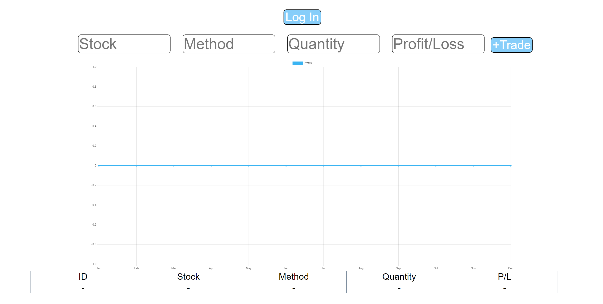

# Stock-Journal
 Video - https://youtu.be/Iv42RtPjpIA
 
 Live Link - https://stockjournal.netlify.app

This app is made using React and Node.js. It allows users to record their stock trades. The trades are saved in a Sqlite3 database. The frontend is hosted on Netlify and the backend on Heroku.

